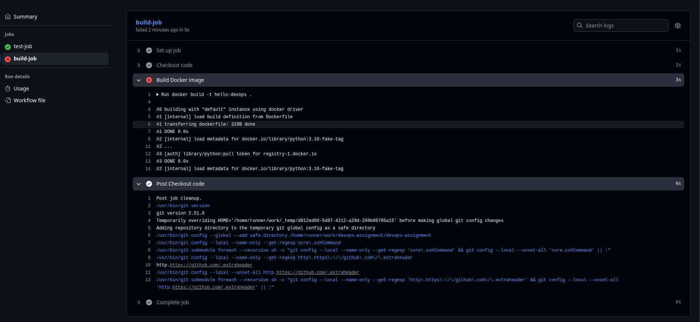

# DEBUGGING.md

## Part A - Pipeline Explanation
This pipeline has two jobs:
1. **test-job** → Runs Python tests to ensure the app runs correctly.
2. **build-job** → Builds the Docker image but only runs after test-job succeeds (using `needs: test-job`).

The pipeline triggers on every push to the `main` branch.
The `needs:` keyword ensures a proper dependency chain — preventing builds if tests fail.

## 🕵️ Part B – The "Break & Fix" Challenge

### 1. The Intentional Break
To simulate a real debugging scenario, I intentionally introduced an error in the `Dockerfile` to a non-existent tag:
```Dockerfile
FROM python:3.10-fake-tag
```

### 2. Error Observed
Docker build failed with error:
#0 building with "default" instance using docker driver
#1 [internal] load build definition from Dockerfile
#1 transferring dockerfile: 318B done
#1 DONE 0.0s
#2 [internal] load metadata for docker.io/library/python:3.10-fake-tag
#2 ...
#3 [auth] library/python:pull token for registry-1.docker.io
#3 DONE 0.0s
#2 [internal] load metadata for docker.io/library/python:3.10-fake-tag

### 3. Root Cause
The image tag didn’t exist in Docker Hub, so Docker couldn’t pull the base image.

### 4. Fix
Reverted to:

```Dockerfile
FROM python:3.10-slim
```

## Screenshot

**Build Error Workflow**

- [Error Workflow Run](https://github.com/Rishav-Upadhaya/devops-assignment/actions/runs/18309945425/job/52135957716)



