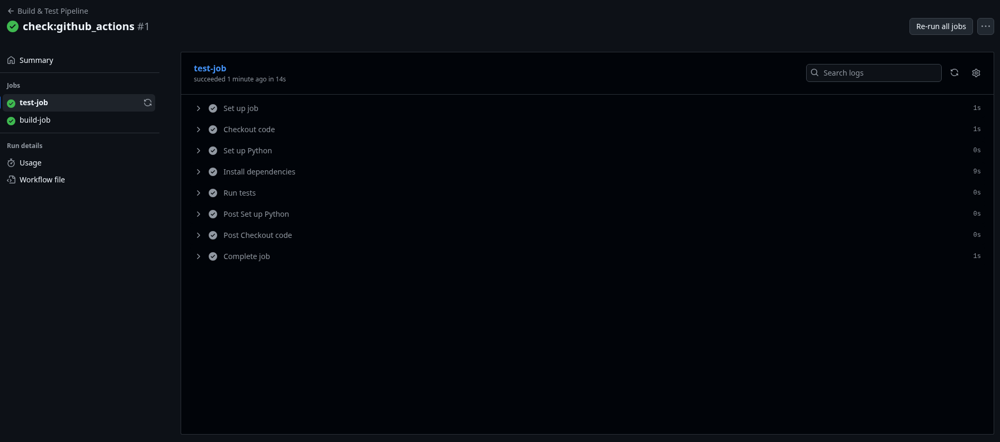

# Submission

## Repository
[GitHub Repo Link](https://github.com/Rishav-Upadhaya/devops-assignment)

## Workflow
- [Successful Workflow Run](https://github.com/Rishav-Upadhaya/devops-assignment/actions/runs/18309318557)

## Screenshots

**Test Workflow**

**Build Workflow**

**Summary**

## Summary
The screenshots above demonstrate the successful execution of both the test and build workflows, along with a summary of the workflow results.

## Deliverables
- Dockerfile ✅
- Workflow ✅
- Logs ✅
